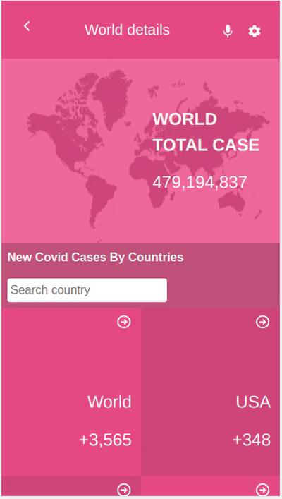

[](https://www.microverse.org/?grsf=04r25h)

# Covid World Statistic
 > Covid statistic page created for mobile devices. 
 - Statistics will update everyday from the [API](https://covid-19.dataflowkit.com/).
 - Main page show new covid cases for every country and also show total covid case number in the world.
 - You can click any country in the main page for see statistic details.



## Live Demo

[Covid World Statistic](https://covid-world-statistic.netlify.app/)
## Built With

- Javascript
- React
- Redux
- React-Bootstrap


## Setup
- Clone this project
```
- $ git clone https://github.com/ahmetbozaci/react-capstone.git
- $ cd react-capstone
```
- Install npm packages
```
- $ npm install
```
- Open website
```
- $ npm start
```
## Authors

👤 **Ahmet Bozacı**
- [Github](https://github.com/ahmetbozaci)
- [Twitter](https://twitter.com/ahmtbozaci)
- [LinkedIn](https://www.linkedin.com/in/ahmetbozaci/)

## 🤝 Contributing

Contributions, issues, and feature requests are welcome!
Feel free to check the [issues page](../../issues/).

## Show your support
Give a ⭐️ if you like this project!

## Acknowledgments
* Original design idea by [Nelson Sakwa on Behance](https://www.behance.net/sakwadesignstudio)
  
## 📝 License

* This project is [MIT](./LICENSE) licensed.
* [Creative Common License of design](https://creativecommons.org/licenses/by-nc/4.0/)

